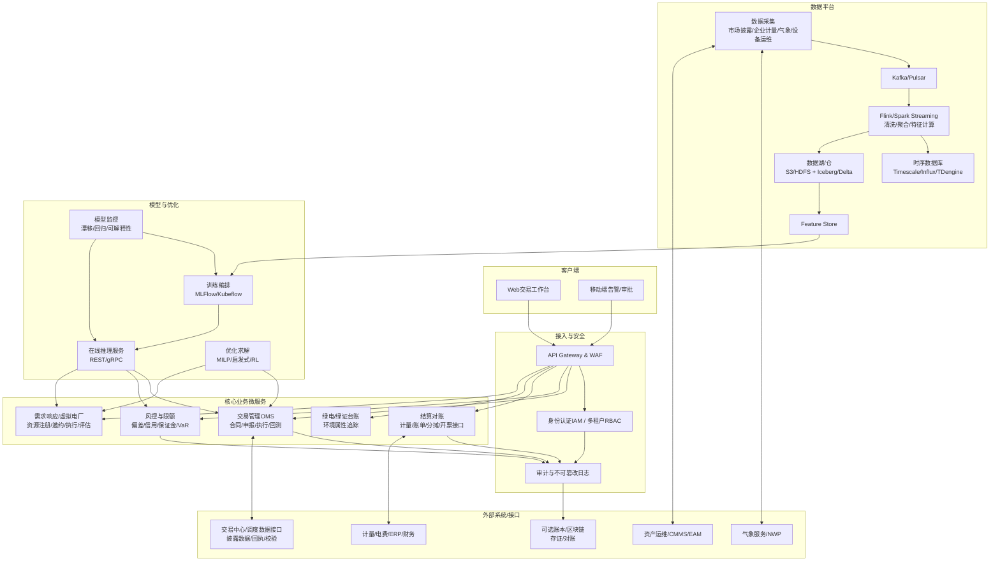

# 电力交易软件与AI赋能方案研究报告

## 执行摘要

在entity["country","中国","country in east asia"]电力市场化改革持续深化、现货与辅助服务等交易品种顶层规则逐步齐备、跨经营区交易常态化推进的背景下，电力交易相关的软件需求正在从“交易填报工具”快速升级为“交易+风险+数据+AI决策”的一体化系统能力。全国统一电力市场体系已明确阶段性目标（到2025年初步建成、到2030年基本建成），并在近两年密集发布“市场运行基本规则 / 现货基本规则 / 辅助服务基本规则 / 注册规则 / 信息披露规则”等关键制度，为软件产品的合规边界、数据接口与业务流程提供了可落地的规则框架。citeturn0search2turn0search11turn10view2turn11view1turn0search18turn15view1turn2search1turn2search5

对“我想开发一个电力交易软件”的最可行切入建议是：**优先定位为“市场主体侧（发电/售电/用户/聚合商/储能）交易与风险管理平台（ETRM/OMS）+ AI预测与优化服务”，而非直接建设省级/区域市场运营机构的撮合出清系统**。原因在于：现货市场采用以集中式出清为主的制度设计，技术支持系统、第三方校验、信息披露、风险防控等要求更贴近“市场运营机构级”工程，进入门槛往往需要与交易机构/调度机构深度合作；而市场主体侧系统可基于披露数据、企业自有数据、合规获取的计量与气象数据形成价值闭环，并能在现货市场加速覆盖的窗口期快速验证商业模式。citeturn12view1turn15view1turn1search2turn11view0

电力行业的核心难点集中在：**规则差异（省网/区域差异与迭代）、数据碎片化与高时效、计量结算与偏差风险、风光波动与系统灵活性约束、以及电力监控与网络安全的高等级要求**。citeturn11view0turn15view1turn10view2turn11view3turn16search0turn16search6  AI行业侧的需求与难点则呈“双向驱动”：一方面，AI（尤其模型训练与推理）带来新增用电需求与绿电/绿证采购需求，推动企业更重视电价管理与绿色电力消费证明；另一方面，AI在电力侧的落地面临数据治理、可靠性/可解释性、极端天气与概念漂移、以及安全合规（关基/隐私）等挑战。citeturn5search0turn5search4turn4search1turn6search3turn6search0

本报告给出可执行结论：  

- 产品路线：**MVP先做“市场主体侧交易工作台+预测+风险/偏差管理+结算对账”，再扩展“储能/VPP优化、辅助服务与绿电绿证、跨省/跨经营区交易支持”。**citeturn1search2turn10view2turn11view1turn4search12turn4search7  
- 技术路线：**数据流（流处理+时序）优先于“纯业务表单”；模型闭环优先于“堆模型”。**信息披露规则下的数据接口与标准化数据格式将成为可扩展的关键。citeturn15view1turn11view0  
- 合规路线：将系统按“涉电力市场数据平台”与“涉电力监控/调度数据（高敏）平台”分区设计，默认不触碰生产控制区数据；如需接入SCADA/EMS，按电力监控系统安全防护规定与等保要求做分区、隔离与认证。citeturn16search6turn7search0turn6search3turn6search0  

**关键假设（未指定信息）与影响**  

- 假设A：你要做的是**服务市场主体**的软件（发电企业/售电公司/用户/负荷聚合商/储能/VPP运营商），而不是省级市场运营机构“官方交易出清系统”。影响：产品可采用SaaS与订阅模式，数据以披露数据+企业自有数据为主，合规门槛相对可控。citeturn10view2turn0search18turn15view1  
- 假设B：初期目标省份选择在**现货连续结算/正式运行进度较快**地区（如已“转正”或已启动连续结算试运行的省份）。影响：更容易获得真实交易节奏与可验证的降本增效指标。citeturn1search2turn10view0turn1search16  
- 假设C：你可合法获取企业侧计量、合同、负荷、资源出力与部分市场披露数据；不假设可直接访问调度生产控制区数据。影响：AI场景优先做预测/风险与策略仿真；调度级闭环控制需后续以项目制/专线/合规评估推进。citeturn16search6turn15view1turn11view3  

## 行业背景与政策环境

电力体制改革的政策主线可概括为：以市场机制形成电能量与调节能力的价格信号，推动“中长期+现货+辅助服务”等市场体系协同运行，并逐步走向全国统一大市场框架。2015年新一轮电力体制改革启动后（常被称为“9号文”及配套文件体系），电力交易机构建设、输配电价改革、售电侧改革等逐步落地，奠定了市场化交易扩容的制度基础。citeturn0search4turn0search12  

从全国统一电力市场顶层设计看，指导意见明确：到2025年全国统一电力市场体系“初步建成”，到2030年“基本建成”，并提出发挥entity["organization","北京电力交易中心","power exchange beijing"]与entity["organization","广州电力交易中心","power exchange guangzhou"]作用、完善跨省跨区交易机制等方向。citeturn0search2turn2search24 2026年国务院层面进一步以实施意见形式强调要打破区域壁垒、完善跨省跨区交易制度、健全现货/中长期/辅助服务/绿电等市场功能，并提出到2030年全国统一电力市场体系基本建成、市场化交易电量占比目标等。citeturn2search1turn2search5turn2search15  

制度规则的“可工程化程度”在2023—2025年显著提高：  

- 《电力市场运行基本规则》（2024年第20号令）从部门规章层面强化了市场风险防控、信息披露原则、反市场分割等制度要求。citeturn0search11turn11view0  
- 《电力现货市场基本规则（试行）》（2023）明确现货市场定义（日前/日内/实时电能量交易）、市场成员构成（含储能、负荷聚合商、虚拟电厂等新型主体），并提出技术支持系统须满足功能测试、第三方校验、并作为试运行/正式运行启动条件的一部分。citeturn10view2turn12view1  
- 《电力辅助服务市场基本规则》（2025）明确辅助服务定义、品种边界与市场成员（含储能、VPP等），并提出“谁提供、谁获利；谁受益、谁承担”的费用与激励原则。citeturn11view1  
- 《电力市场注册基本规则》（2024）将虚拟电厂、储能等纳入“新型经营主体”范畴，强调交易机构注册受理的公平公开与信息披露。citeturn0search18  
- 《电力市场信息披露基本规则》（2024）提出建设全国统一的“全市场、全品种、全周期、全主体”信息披露体系，明确由电力交易机构统一负责信息披露实施、建立披露平台及标准化数据格式，并在确保安全前提下提供数据接口服务。citeturn15view1  

省级现货市场改革进展直接决定了软件需求的“交易节奏复杂度”。2017年启动了首批8个现货试点（南方/entity["place","蒙西","inner mongolia west grid"]/entity["state","浙江","zhejiang province, china"]/entity["state","山西","shanxi province, china"]/entity["state","山东","shandong province, china"]/entity["state","福建","fujian province, china"]/entity["state","四川","sichuan province, china"]/entity["state","甘肃","gansu province, china"]），并在2023—2025年进入“转正”和连续结算加速期。citeturn1search16turn1search2turn10view0 2025年国家层面通知进一步明确：entity["state","湖北","hubei province, china"]应在2025年6月底前、浙江在2025年底前转入正式运行；并推动更多省份在2025年底前启动现货市场连续结算试运行，以实现“基本实现现货市场全覆盖”的目标导向。citeturn1search2  

跨经营区交易机制的工程化推进，意味着未来“跨entity["company","国家电网有限公司","china state grid"]—entity["company","中国南方电网有限责任公司","china southern grid"]经营区”的平台互联互通、数据共享与联合结算将成为新常态。机制方案明确由两大交易中心与调度控制中心联合组织、联合发布结果、联合结算，并强调交易平台互联互通。citeturn10view1turn1search6  

结论与可执行建议：将产品“制度适配层”作为核心竞争力建设，建立“规则版本化（Rule-as-Code）+省份插件化（Market Adapter）”能力，以应对各省细则差异与频繁迭代；并优先选择现货连续结算成熟地区开展试点，从一开始就把信息披露、第三方校验与风险防控流程体现在产品设计中。citeturn11view0turn12view1turn15view1turn1search2  

## 市场需求

电力交易软件的市场需求并非单一“下单撮合”，而是围绕“交易—执行—计量—结算—偏差—风险—合规—复盘”的全链路，叠加新能源与灵活性资源带来的预测与优化需求。现货市场规则明确，经营主体范围已扩展至分布式发电、负荷聚合商、储能与虚拟电厂等；同时现货市场要通过时空价格信号提升系统调节能力并促进可再生能源消纳，这直接拉高对预测与优化软件的刚性需求。citeturn10view2turn12view1  

发电侧需求重点在于：  

- 报量报价与出清价格不确定性下的收益管理：现货价格信号与偏差结算逻辑要求企业具备更精细的出力预测、边际成本曲线管理与报价策略回测能力。citeturn12view1turn15view1  
- 新能源参与市场的机制适配：规则明确要稳妥推动新能源参与，设计适应新能源特性的市场机制，并与保障性政策衔接；对软件而言意味着需要兼顾“保障利用小时/固定电价”与“市场化电量”两类资产与合同的组合管理。citeturn12view1turn4search5  

售电侧（零售市场）需求主要是：  

- 批发—零售价差与风险管理：现货与中长期多个时间尺度叠加后，售电公司需要统一的合同台账、负荷画像、偏差/考核测算与对冲策略工具。现货规则也明确要推动零售市场建设并畅通批发、零售价格传导。citeturn12view1turn11view2  
- 信息披露与用户数据保密：现货规则对售电公司提出获取代理零售用户负荷信息同时承担用户信息保密义务的要求，信息披露规则也强化了信息分类与保密、封存机制。citeturn12view1turn15view1  

输配与电网相关需求（对外部软件更偏“接口与协同”）是：  

- 交易执行与安全校核、结算协同：跨经营区交易方案明确不同交易类型需要设计交易组织、安全校核、交易执行与结算等流程，并实现平台间信息实时共享与共同披露。citeturn10view1turn1search6  
- 市场运营机构的风险监控责任：市场运行基本规则强调市场运营机构需履行市场监控与风险防控责任。对软件企业而言，若参与运营机构级系统建设，需要在架构层面满足更高的审计与监管要求。citeturn11view0  

用户侧与需求响应需求在近年明显增强：  

- 负荷管理办法将需求响应定义为应对供需紧张与新能源消纳困难，通过经济激励引导用户自愿调整用电行为，实现削峰填谷、提高系统灵活性；并提出各地建立负荷管理中心、新型负荷管理系统建设等。citeturn11view3  
- 需求侧管理办法（2023）将需求响应、绿色用电、智能用电等纳入用电侧综合措施框架，强化“用电环节优化配置电力资源”的政策空间。citeturn3search3turn3search7  

可再生并网、储能与灵活性资源需求是交易软件的增量核心：  

- 储能与新型主体在现货、辅助服务中有明确市场定位。辅助服务规则将储能、虚拟电厂等纳入经营主体范围并强调“可观、可测、可调、可控”能力要求。citeturn11view1turn0search18  
- 2024年全国层面总结显示：多地通过容量租赁、现货、辅助服务等探索新型储能商业模式；并指出若干省份现货市场转入正式运行/连续结算试运行，推动独立储能以“报量不报价/报量报价”等方式参与现货市场，通过价格信号引导调节。citeturn10view0  

绿电与绿证交易催生“环境属性管理”软件需求：绿证制度明确“1个绿证对应1000度可再生能源电量”，并强调绿证是绿色电量环境属性的唯一证明；政策也明确三家电网公司依托相应交易中心开展绿电交易平台。citeturn4search1turn4search12turn4search5 这要求软件能把“电能量合同—绿证划转—消费证明—审计追踪”做成可追溯链条。

结论与可执行建议：用“角色×品种×周期”三维拆解需求（发电/售电/用户/聚合商/储能 × 中长期/现货/辅助服务/绿电绿证 × 年-月-日-实时），按现货覆盖加速的节奏优先满足“高频、可量化ROI”的场景：偏差测算、结算对账、报价辅助与压力测试、需求响应执行与评估。citeturn1search2turn11view3turn12view1turn16search4  

## AI需求与应用场景

电力交易软件中的AI并不是“附加功能”，而更像是应对新能源波动、现货价格波动与多品种耦合的必要能力。现货市场建设目标强调形成体现时间与空间特性、反映供需变化的价格信号，并促进可再生能源消纳、提升系统调节能力；这天然要求预测、优化与风险控制算法成为业务闭环的一部分。citeturn12view1  

面向电力行业的AI高价值场景可归纳为八类：  

- 预测：负荷预测、价格预测、风光出力预测、用户响应概率预测。负荷与风电预测领域的深度学习综述研究普遍指出：模型正朝更强的时空建模、在线更新与鲁棒性方向发展，以应对高维特征与非平稳性。citeturn5search5turn5search6  
- 优化：报价策略优化、组合对冲、储能充放电/容量租赁策略、VPP聚合资源调度（常与鲁棒优化、随机优化、强化学习等结合）。citeturn5search11turn5search23turn10view0  
- 异常检测：计量异常、数据漂移、设备故障先兆、交易行为异常（合规角度可用于内部风控与审计）。信息披露规则强调信息披露真实性与封存管理，异常检测可作为“内部控制”的技术抓手。citeturn15view1turn11view0  
- 交易撮合与策略仿真：在中国现货集中出清模式下，AI更现实的落点是“出清/结算仿真引擎+策略回测”，用于评估报价与偏差风险，而非替代官方出清。citeturn10view2turn12view1  
- 虚拟电厂与需求响应：政策鼓励虚拟电厂公平参与各类电力市场或需求响应，并明确满足注册规则要求后可独立主体参与交易；负荷管理办法也给出了需求响应执行与评估流程（邀约确认、效果评估等），为AI驱动的“响应预测—执行优化—效果评估”闭环提供制度接口。citeturn4search7turn11view3turn0search18  
- 能量管理（EMS）与源网荷储协同：储能发展报告显示多地推动储能以不同方式参与现货与辅助服务，通过价格信号引导调节；这类场景需要把“电价结构+约束（功率/容量/寿命）+用户需求”统一建模。citeturn10view0turn11view1  
- 市场情报与自然语言：面向规则解读、公告解析、交易复盘的“文本智能”需求上升，电力系统预测技术的研究也开始讨论大语言模型在预测与辅助决策中的潜力，但对一致性与可验证性提出更高要求。citeturn5search23turn15view1  
- 可信与可解释AI：电力交易的高风险属性（资金、保供、监管）决定模型需要可解释、可审计与可回滚；市场运行基本规则强调风险防控机制，信息披露也强调真实性与责任，这对AI治理提出明确约束。citeturn11view0turn15view1  

AI行业（电力作为被服务对象）的需求与难点同样会影响你的产品定位：  

- 电力需求侧：entity["organization","国际能源署","intergovernmental energy agency"]关于“能源与AI”的报告强调AI相关用电需求可能在未来十年显著增长，数据中心与AI负载将成为电力系统规划与电价管理的重要变量。citeturn5search4turn5search0  
- 绿电与合规：绿证制度对绿色属性的唯一性与1000度对应关系提供了可量化的“绿色电力消费证明”工具，AI企业购买绿电/绿证的管理将产生对“可追溯台账+审计报表+交易执行”的软件需求。citeturn4search1turn4search5turn4search12  

结论与可执行建议：AI能力要与交易闭环强绑定，优先交付“可计量收益”的模型：短期负荷/价格/风光预测（用于报价与偏差风险）、储能/VPP调度优化（用于套利与辅助服务收益）、以及结算对账与异常检测（用于降低损失与合规风险）。同时建立模型治理：数据版本、特征版本、模型版本、解释与回滚机制一体化上线。citeturn11view0turn15view1turn10view0turn11view3  

## 数据需求与来源

电力交易软件的数据体系应按“交易域数据 + 物理运行域数据 + 外部环境数据 + 资产与运维数据”分层，并明确每层的合规边界与时效要求。现货规则明确电网企业与调度机构需要为市场提供支撑交易与服务所需的数据并保证数据交互准确及时，同时强调按国家网络安全有关规定进行数据交互；信息披露规则则从全国统一层面要求交易机构建立披露平台、标准化格式并在保障信息安全前提下提供数据接口。citeturn12view1turn15view1  

关键数据需求与可获得性（从易到难）可概括为：  

- 市场与交易数据：市场公告、交易结果、分时价格、出清电量、结算参数、信用与信息披露条目。信息披露规则将信息分为公众/公开/特定三类，并以附表方式列出大量披露条目，且要求统一格式与时限，这为“标准化市场数据层”提供了制度基础。citeturn15view1turn11view0  
- 计量与结算数据：关口计量、电费结算、偏差电量、费用分摊。国家层面已发布计量结算基本规则以解决计量管理不规范、单位不统一、流程衔接不顺等问题，并指出随着煤电、新能源、工商业用户全面参与市场，计量结算统一规范的必要性上升。citeturn16search1turn16search4turn11view3  
- 负荷与需求响应数据：用户侧负荷曲线、可中断/可调负荷容量、响应执行记录与效果评估。负荷管理办法明确需求响应定义与执行评估职责分工，为数据字段与评估口径提供规则锚点。citeturn11view3  
- 气象与环境数据：风速、辐照度、温度湿度、极端天气预警、天气预报（NWP）。风光预测与负荷预测的学术综述普遍显示，将NWP与深度学习结合是提升短期预测的重要路径。citeturn5search6turn5search5  
- 实时SCADA/EMS/调度数据：机组出力、AGC指令、设备状态、网络约束、潮流等。该层数据通常与电力监控系统/调度数据网相关，受更严格的安全分区、隔离与认证要求约束。电力监控系统安全防护规定要求落实等级保护制度并强调“安全分区、网络专用、横向隔离、纵向认证”，并在2024年修订版中进一步强化了安全要求与适用范围。citeturn16search6turn16search0turn8search26turn6search3turn7search0  
- 资产运维数据：设备台账、检修计划、故障记录、健康状态。现货规则要求发电企业提供检修计划、实测参数、预测运行信息等，提示“运行—交易”数据协同的重要性。citeturn12view1  

数据治理的关键难点在于：跨主体数据权限与口径不统一、时间同步与缺失值、以及在不同市场周期之间建立一致的“事实表”（例如合同电量、出清电量、计量电量、结算电量之间的关系）。信息披露规则提出标准化格式与接口服务，将在一定程度上降低“市场数据层”的集成成本，但企业侧与监控侧数据仍需要项目化治理。citeturn15view1turn16search6  

结论与可执行建议：数据侧优先建立“三张底座表”——(1)市场价格与出清事实表（按省/节点/时段），(2)企业计量与合同事实表（按计量点/用户/合同），(3)资源与气象事实表（按场站/设备/地理）。并以“披露数据为起点、企业自有数据扩展、监控侧数据谨慎接入”为原则，先做可商业闭环的数据产品，再逐步提升实时性与颗粒度。citeturn15view1turn12view1turn16search6  

## 关键技术架构与功能设计

电力交易软件的技术架构应同时满足：高并发交易事件处理、严格审计与可追溯、时序数据管理、模型训练与在线推理、以及合规隔离（尤其是与电力监控系统相关的数据域隔离）。现货规则将“技术支持系统功能符合要求、第三方校验、连续多日出清”作为试运行/结算试运行/正式运行的重要条件，这提示即使是市场主体侧系统，也应以可验证的工程标准设计“仿真/计算引擎”和数据管道。citeturn12view1turn11view0turn15view1  

image_group{"layout":"carousel","aspect_ratio":"16:9","query":["电力现货市场 出清流程 示意图","电力交易 平台 系统架构 图","虚拟电厂 调度 架构 示意图"],"num_per_query":1}

**推荐总体架构（逻辑分层）**  

- 体验层：Web管理台（运营/交易员/风控/财务/运维）、移动端（告警/审批）、多租户与权限。  
- 业务层：交易管理（合同/申报/执行）、风险管理（偏差/信用/限额）、结算对账、绿电绿证、需求响应与VPP。  
- 数据层：流式采集（市场数据/计量/气象）、时序库（秒-分钟级）、数据湖/仓（历史回测与训练）、特征库（Feature Store）。  
- 智能层：训练平台（离线训练+AutoML/监控）、推理服务（在线预测）、优化求解器（MILP/启发式/RL）。  
- 基础设施层：微服务+服务网格、消息队列/流处理、可观测性、安全与审计、可选账本/区块链。  

**系统架构图（Mermaid示意）**  

**功能需求表（模块—功能点—优先级—依赖数据/接口）**  
| 模块 | 功能点（示例） | 优先级（MVP→增强） | 依赖数据/接口 |
|---|---|---|---|
| 市场适配层（Market Adapter） | 省份规则配置、交易品种/时间尺度映射、限价/出清口径配置、规则版本管理 | P0 | 各省细则/公告、披露数据口径citeturn15view1turn12view1 |
| 用户与权限 | 多租户、RBAC、岗位权限、双人复核、操作留痕 | P0 | IAM、审计日志（合规要求）citeturn11view0turn6search0 |
| 合同与持仓 | 中长期合同台账、分时曲线、绿电合同与环境属性关联 | P0 | 合同/电量曲线、绿证划转规则citeturn11view2turn4search1turn4search12 |
| 报量报价/申报 | 申报模板、批量导入、校验、回执管理、申报截止提醒 | P0 | 交易中心接口/回执、披露规则时限citeturn12view1turn15view1 |
| 预测（负荷/价格/风光） | 日前/日内/短时预测、置信区间、特征工程自动化 | P0→P1 | 历史价格与出清、负荷、气象/NWPciteturn12view1turn5search5turn5search6 |
| 交易策略与仿真 | 出清仿真（集中出清近似）、策略回测、敏感性分析 | P1 | 历史出清数据、规则参数、资源约束citeturn12view1turn15view1 |
| 风险管理 | 偏差电量测算、保证金/授信、限额、压力测试、异常交易监测 | P0→P1 | 计量/合同/出清、信用与披露信息citeturn11view0turn15view1turn16search4 |
| 结算对账 | 计量点管理、账单对账、差价/差量结算辅助、分摊核算 | P0 | 计量结算规则、计量/财务接口citeturn16search4turn16search1turn11view2 |
| 辅助服务 | 辅助服务品种台账、收益测算、参与资格与可调能力校核 | P1 | 辅助服务规则、设备可调数据citeturn11view1turn10view0 |
| 需求响应/虚拟电厂 | 资源注册、可调容量建模、邀约—确认—执行—评估、收益结算 | P1→P2 | 负荷管理流程、注册规则、计量数据citeturn11view3turn4search7turn0search18 |
| 数据平台 | 流采集、数据质量规则、数据血缘、特征库 | P0→P1 | 披露数据接口、企业数据源、气象源citeturn15view1turn12view1 |
| 安全与合规 | 等保控制点映射、脱敏/加密、密钥管理、审计封存、应急预案 | P0 | 等保标准、关基/隐私法规citeturn7search0turn6search3turn6search0turn6search1 |

**技术选型对比表（建议口径：优先“成熟生态+可运维性+可审计性”）**  
| 组件 | 方案A | 方案B | 方案C | 选择建议（面向MVP→规模化） |
|---|---|---|---|---|
| 业务数据库（OLTP） | PostgreSQL | MySQL | TiDB（分布式） | MVP优先PostgreSQL；跨地域/强扩展再评估TiDB（成本与运维更高） |
| 分析型数据库（OLAP） | ClickHouse | StarRocks | Trino+Lakehouse | 报表/归因强依赖OLAP时优先ClickHouse；与湖仓统一则Trino更灵活 |
| 流处理 | Apache Flink | Spark Streaming | Kafka Streams | 有“秒级特征+事件驱动”需求优先Flink；纯轻量聚合可Kafka Streams |
| 消息队列/日志 | Kafka | Pulsar | RocketMQ | Kafka生态最成熟；对多租户隔离与分层存储要求高可评估Pulsar |
| 时序数据库（TSDB） | TimescaleDB | InfluxDB | TDengine | 以SQL生态与多维分析为主选Timescale；高写入与运维简化可Influx/TDengine（按团队经验） |
| ML框架 | PyTorch | TensorFlow | XGBoost/LightGBM（树模型） | 深度时序预测优先PyTorch；结构化特征与小样本补充树模型 |
| 训练/实验管理 | MLflow | Kubeflow | Airflow + 自研 | MVP可MLflow；规模化与多团队协作再上Kubeflow |
| 在线推理 | KServe | Triton Inference Server | 自研FastAPI/gRPC | MVP可自研+限流；多模型多框架与GPU池化再考虑Triton/KServe |
| 账本/区块链（可选） | Hyperledger Fabric | FISCO BCOS | 传统不可篡改日志（WORM/哈希链） | 若仅存证与审计，优先“WORM+哈希链”降低复杂度；多方协同强需求再引入联盟链 |

结论与可执行建议：架构设计务必把“规则版本化、数据时序化、审计可追溯、模型可治理”当作一等公民；撮合引擎在市场主体侧更适合做“仿真与策略回测”，真正的市场出清需以合规合作方式推进；区块链优先作为“可选存证层”，避免在MVP阶段引入不必要的复杂度。citeturn12view1turn11view0turn15view1turn16search6  

## 合规与安全

电力交易软件的合规与安全需要同时满足“电力监管合规 + 数据合规 + 网络与关基安全”。市场运行基本规则要求建立风险防控机制，电力市场信息披露强调真实性、封存与监督；而电力监控系统安全防护规定（2024年第27号令）与关键信息基础设施安全保护条例共同构成了“涉电力监控/调度数据系统”的高压合规框架。citeturn11view0turn15view1turn16search6turn6search3  

监管与业务合规要点：  

- 市场主体身份与注册：注册基本规则强调交易机构公平公开受理注册，不得设置歧视性条件；且新型主体（储能、VPP、微电网等）被纳入经营主体范围，这意味着你的产品若服务这些主体，需要支持其注册信息与资质材料管理、以及不同主体的准入条件校验。citeturn0search18turn11view1  
- 信息披露与数据接口：信息披露规则构建“全市场、全品种、全周期、全主体”体系，将信息分为公众/公开/特定三类，并要求交易机构统一负责披露平台与标准格式、接口服务，这决定了你在数据接入与对外展示上的边界（哪些可以公开、哪些必须授权、哪些必须封存）。citeturn15view1  
- 计量结算：计量结算基本规则发布背景指出各地计量管理要求不规范、流程衔接不顺畅等问题，电费结算不及时等将带来经营风险，软件需强化“对账、差异定位、证据链留存”。citeturn16search4turn16search1  

数据与网络安全要点：  

- 个人信息与数据安全：个人信息保护法、数据安全法、网络安全法为通用底座，要求将个人信息处理、数据分级分类、最小必要、访问控制与安全事件处置纳入制度化流程。citeturn6search0turn6search1turn6search6  
- 等保与关基：关键信息基础设施安全保护条例明确能源等重要行业领域属于关键信息基础设施重点保护范围，并要求在等级保护基础上采取保护措施；等保2.0核心标准（GB/T 22239-2019）为“控制点清单”提供参考框架。citeturn6search3turn7search0  
- 电力监控系统安全：2024修订版电力监控系统安全防护规定明确适用范围，并强调与网络安全法、关基条例衔接；历史版本中提出“安全分区、网络专用、横向隔离、纵向认证”原则，这对任何试图接入SCADA/EMS/调度数据网的系统都是硬约束。citeturn16search6turn8search26turn16search0  

**关键KPI与评估方法（建议同时覆盖业务、模型与系统）**  
| KPI类别 | 指标示例 | 评估方法与频率 | 目标设定建议 |
|---|---|---|---|
| 交易执行 | 申报准时率、回执成功率、交易/申报差错率 | 日/周；与交易中心回执对账 | MVP阶段以“零差错+高准时”优先 |
| 风险与结算 | 偏差预测误差、偏差成本降低比例、对账差异关闭时长 | 月；以结算账单为准；A/B对比 | 以“可核验节省金额”作为销售抓手citeturn16search4turn11view3 |
| 预测模型 | 负荷MAPE、价格RMSE、风光预测分位数覆盖率PICP | 日/周；滚动窗口；极端天气单独统计 | 引入漂移监控与回滚门槛citeturn5search5turn5search6 |
| 优化效果 | 储能套利收益提升、辅助服务收益提升、VPP响应履约率 | 月/季度；与财务结算闭环 | 先用仿真收益，后用真实收益验证citeturn10view0turn11view1 |
| 系统可靠性 | 可用性（SLA）、核心链路延迟、RPO/RTO、告警MTTA/MTTR | 实时/周报；SRE仪表盘 | 关键链路（申报/对账）优先SLA |
| 合规与安全 | 审计覆盖率、敏感数据访问违规次数、安全事件数 | 月/季度；审计报告 | 与披露、封存、追溯要求对齐citeturn15view1turn16search6 |

结论与可执行建议：合规设计必须前置到架构层，建议采用“数据分域+最小权限+全链路审计+可封存证据链”的默认策略；若未来需要接入电力监控系统数据，必须以专网/隔离/认证为前提，并将等保与关基要求纳入项目里程碑与验收标准。citeturn16search6turn7search0turn6search3turn15view1  

## 商业模式、路线图、团队成本与风险

商业模式建议采用“交易+数据+AI订阅”的组合，以适配电力市场在不同省份的成熟度差异：  

- 交易费/按量收费：更适合你与交易平台深度耦合、能直接影响成交与结算流程的产品形态；但在市场主体侧通常更现实的是“按用户数/资产量/数据量/模型调用量”计费。citeturn12view1turn15view1  
- 增值服务：偏差管理、结算对账自动化、风险报告、合规审计包。计量结算规则出台背景已指出电费结算不及时、流程不顺畅等痛点，适合做强ROI增值包。citeturn16search4turn16search1  
- 数据服务：市场数据标准化、历史回放、指标与基准、绿电绿证台账与审计报表。信息披露规则强调统一格式与接口服务，为数据产品化提供了政策空间。citeturn15view1turn4search1  
- AI订阅：预测（负荷/价格/风光）与优化（储能/VPP/报价）。同时，AI企业绿电采购与消费证明需求上升，可与绿证台账形成联动产品。citeturn5search4turn4search1turn4search12  

实施路线图与里程碑（按“可验证闭环”组织）：  

- 里程碑M0（0–2个月）：市场选型与规则适配框架确定（至少覆盖一个省的中长期+现货披露数据口径）；搭建数据采集与审计底座。citeturn15view1turn12view1  
- 里程碑M1（2–4个月）：MVP上线（交易工作台+合同台账+负荷/价格基础预测+偏差测算+对账）；完成1–2家客户沙箱验证。  
- 里程碑M2（4–7个月）：加入“结算对账自动化+异常检测+策略回测”；以真实结算账单验证节省金额。citeturn16search4turn15view1  
- 里程碑M3（7–12个月）：扩展辅助服务与绿电绿证模块；接入储能/VPP优化（先仿真、后实盘）；形成可规模销售的行业模板。citeturn11view1turn10view0turn4search7turn4search12  
- 里程碑M4（12个月+）：跨省/跨经营区交易支持、更多省份Market Adapter插件化复制；如进入运营机构级系统，启动第三方校验与更高级别合规设计。citeturn10view1turn12view1turn11view0  

团队与成本估算（区间，按市场主体侧SaaS假设）：  

- 关键岗位：电力市场产品经理（懂规则与结算）、电力交易/风险专家（可外聘）、后端/数据工程（流处理+时序）、算法工程（预测+优化）、前端、测试、SRE/安全、合规/法务。  
- 人员规模：MVP期建议12–18人；规模化与多省复制期20–35人。  
- 预算范围：若采用云原生与托管中间件，首年总投入通常在**人民币 800万–2500万**区间（人力为主，叠加云资源、数据采购、合规测评、试点项目交付成本）。若目标升级为“市场运营机构级撮合/出清系统”，预算与周期通常显著增加（常见需要数千万元级与更长交付周期），且合作与准入门槛更高。citeturn12view1turn11view0turn16search6  

主要风险与缓解措施：  

- 规则迭代与省间差异风险：用“规则版本化+自动化回归用例+省份插件”缓解，并持续跟踪国家层面规则更新（现货、辅助服务、计量结算、信息披露等）。citeturn11view2turn11view1turn16search1turn15view1  
- 数据获取与质量风险：以信息披露平台与企业自有数据为主，建立数据质量SLA、缺失/异常修复与证据留存。citeturn15view1turn16search4  
- 模型失效与极端事件风险：引入漂移监控、极端天气单独评估、保守策略与人工兜底；将模型输出与风险限额联动。citeturn5search5turn5search6turn11view0  
- 安全合规与关基风险：默认不接入生产控制区；若必须接入，按电力监控系统安全防护规定实施分区隔离与认证，并完成等保控制点落地。citeturn16search6turn7search0turn6search3  
- 商业化验证周期风险：优先交付“结算可核验节省金额”的功能（偏差/对账/策略回测），缩短销售闭环；选择现货连续结算成熟省份试点，提高验证效率。citeturn1search2turn10view0turn16search4  

**参考资料与优先级来源列表（按优先级由高到低）**  

- 国家层面政策与规则（最高优先级）：电力市场运行基本规则（2024）citeturn0search11turn11view0；电力现货市场基本规则（试行）（2023）citeturn0search1turn12view1；电力辅助服务市场基本规则（2025）citeturn3search4turn11view1；电力市场注册基本规则（2024）citeturn0search18；电力市场信息披露基本规则及权威解读citeturn15view1；电力市场计量结算基本规则及权威解读citeturn16search1turn16search4；加快建设全国统一电力市场体系指导意见（2022）citeturn0search2turn2search24；全面加快电力现货市场建设通知（2025）citeturn1search2；跨电网经营区常态化电力交易机制方案（2025）citeturn10view1；完善全国统一电力市场体系实施意见（2026）与解读citeturn2search1turn2search5。  
- 绿电绿证与需求侧政策（高优先级）：绿电交易试点启动与政策说明citeturn4search0turn4search12；绿证全覆盖通知与解读citeturn4search5turn4search1；电力负荷管理办法（2023）citeturn11view3；电力需求侧管理办法（2023）citeturn3search3；虚拟电厂政策解读与参与市场机制citeturn4search7turn4search19。  
- 行业报告（中高优先级）：中国新型储能发展报告（2025）citeturn10view0；IEA关于中国统一电力市场体系研究citeturn0search6。  
- 安全与法律（最高优先级）：个人信息保护法citeturn6search0；数据安全法citeturn6search1；网络安全法citeturn6search6；关键信息基础设施安全保护条例citeturn6search3；电力监控系统安全防护规定（2024年第27号令）citeturn16search0turn16search6；等保2.0核心标准GB/T 22239-2019citeturn7search0；电力法citeturn7search2；电力监管条例citeturn7search1。  
- 学术与国际AI能源报告（中优先级）：负荷预测深度学习综述与研究方向citeturn5search5；短期风电预测综述citeturn5search6；电力系统预测与大语言模型综述citeturn5search23；IEA能源与AI报告citeturn5search4turn5search0；entity["organization","国际可再生能源署","intergovernmental renewable energy"]AI与大数据创新简报citeturn5search20。  

结论与可执行建议：商业上以“可核验ROI”打穿首批客户（偏差/对账/预测/策略回测），技术上以“数据与规则底座”承载多省复制，合规上把“分域隔离+审计封存+等保映射”作为产品能力对外售卖（尤其面向大型用能企业与能源集团），从而在电力与AI两端需求共同增长的周期中建立可持续护城河。citeturn2search5turn15view1turn1search2turn16search6turn5search4