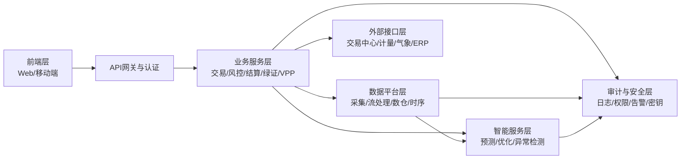
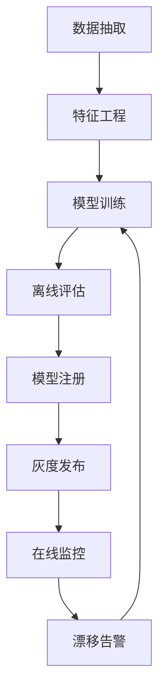

# 电力交易AI平台开发文档

## 1. 文档信息

| 项目 | 内容 |
|---|---|
| 文档名称 | 电力交易AI平台开发文档 |
| 版本 | v1.0 |
| 编写日期 | 2026-04-08 |
| 适用阶段 | 立项、MVP开发、试点交付 |
| 依据文件 | `deep-research-report.md` |

---

## 2. 项目目标与范围

### 2.1 项目目标

构建面向市场主体（发电企业、售电公司、用户侧聚合商、储能运营方）的电力交易与风险管理平台，核心目标如下：

1. 支持中长期与现货交易场景下的交易作业与流程管理。  
2. 提供负荷/价格/出力预测能力，降低偏差成本。  
3. 提供结算对账和风险分析能力，形成可核验的降本增效价值。  
4. 在满足合规要求前提下，沉淀可多省复制的规则适配能力。  

### 2.2 范围定义

| 分类 | 本期纳入（MVP） | 本期不纳入（后续） |
|---|---|---|
| 交易能力 | 合同台账、申报辅助、回执管理、交易复盘 | 省级交易机构官方出清系统 |
| 风险能力 | 偏差测算、限额管理、风险预警 | 全市场级监管风控平台 |
| AI能力 | 短期负荷预测、价格预测、基础策略建议 | 全自动实盘决策闭环 |
| 数据能力 | 披露数据+企业自有数据接入 | 深度接入生产控制区SCADA/EMS |
| 结算能力 | 账单对账、差异定位、报表输出 | 金融级清算中心能力 |

### 2.3 关键非功能目标

| 类别 | 目标值 |
|---|---|
| 可用性 | 核心服务月可用性 >= 99.9% |
| 性能 | 高频查询P95 < 1s；批处理任务按日准时完成 |
| 安全 | 最小权限、全链路审计、敏感数据脱敏 |
| 可追溯 | 交易与模型决策留痕可追溯 |
| 可扩展 | 新省份规则接入周期 <= 2周（目标） |

---

## 3. 业务角色与职责

| 角色 | 关键职责 | 典型页面 |
|---|---|---|
| 交易员 | 申报、策略查看、执行跟踪 | 交易工作台、申报中心 |
| 风控专员 | 限额配置、偏差预警、风险复盘 | 风险看板、压力测试 |
| 结算专员 | 账单导入、差异处理、报表出具 | 对账中心、结算报表 |
| 管理员 | 用户、权限、审计、配置管理 | 系统管理、审计中心 |
| 算法工程师 | 模型训练、上线、监控、回滚 | 模型中心、特征中心 |

---

## 4. 系统总体架构

### 4.1 架构原则

1. 规则优先：采用 Rule-as-Code，支持省份与规则版本并存。  
2. 数据驱动：流批一体，统一时序与事实口径。  
3. 合规内建：默认分域隔离、最小权限、审计封存。  
4. AI可治理：数据版本、特征版本、模型版本统一管理。  
5. 渐进演进：MVP先闭环，再逐步扩容。  

### 4.2 架构分层



### 4.3 部署环境

| 环境 | 用途 | 部署策略 |
|---|---|---|
| DEV | 日常开发联调 | 单集群低成本部署 |
| SIT | 集成测试 | 接近生产配置 |
| UAT | 业务验收 | 使用脱敏准生产数据 |
| PROD | 正式运行 | 双可用区，高可用部署 |

---

## 5. 功能设计

### 5.1 模块清单

| 模块 | 子功能 | 优先级 |
|---|---|---|
| 市场规则适配 | 规则配置、版本管理、校验引擎 | P0 |
| 交易管理 | 合同台账、申报模板、回执跟踪 | P0 |
| 风险管理 | 偏差预测、限额控制、异常预警 | P0 |
| 结算对账 | 账单导入、差异定位、对账闭环 | P0 |
| 数据平台 | 数据接入、质量校验、血缘管理 | P0 |
| AI预测 | 负荷预测、价格预测、评估报告 | P1 |
| 策略仿真 | 历史回测、敏感性分析 | P1 |
| 需求响应/VPP | 资源台账、邀约执行、效果评估 | P2 |
| 绿电绿证 | 证书台账、划转跟踪、审计报表 | P2 |

### 5.2 核心流程示例

#### 流程A：交易申报流程

1. 交易员选择交易日与交易品种。  
2. 系统加载省份规则并执行前置校验。  
3. 调用预测服务生成建议申报区间。  
4. 交易员确认后提交申报。  
5. 系统记录回执并触发审计留痕。  

#### 流程B：结算对账流程

1. 定时导入结算账单与企业计量数据。  
2. 系统按统一口径生成对账结果。  
3. 自动识别差异类型（时间错位、口径差异、缺数）。  
4. 生成整改任务并跟踪关闭。  
5. 输出月度对账报告。  

---

## 6. 数据架构与数据模型

### 6.1 数据分层

| 分层 | 说明 | 典型数据 |
|---|---|---|
| ODS | 原始接入层 | 公告、价格、计量、气象 |
| DWD | 明细标准层 | 清洗后的交易明细、计量明细 |
| DWS | 主题汇总层 | 偏差主题、结算主题、风险主题 |
| ADS | 应用服务层 | 看板指标、报表结果、接口输出 |

### 6.2 核心事实表

| 表名 | 主键示例 | 用途 |
|---|---|---|
| `fact_market_clearing` | `province_id + market_date + timeslot` | 出清价格/电量事实 |
| `fact_metering` | `meter_id + ts` | 计量时序数据 |
| `fact_contract_position` | `contract_id + market_date` | 合同与持仓 |
| `fact_settlement_bill` | `bill_id + org_id + cycle` | 结算账单 |
| `fact_forecast_result` | `model_id + target + ts` | 预测结果与误差 |

### 6.3 维度表

| 表名 | 说明 |
|---|---|
| `dim_org` | 组织与主体信息 |
| `dim_market_rule` | 省份规则与版本 |
| `dim_resource_asset` | 机组/储能/负荷资源信息 |
| `dim_calendar` | 交易日历与时段维度 |

### 6.4 数据质量规则

1. 完整性：核心字段非空率 >= 99.9%。  
2. 准确性：价格、计量等关键字段范围校验。  
3. 一致性：合同电量、计量电量、结算电量口径一致。  
4. 时效性：日报在T+1 08:00前完成入仓。  
5. 可追溯性：每条数据保留来源、版本、处理链路。  

---

## 7. 接口设计规范

### 7.1 API通用规范

| 项目 | 规范 |
|---|---|
| 协议 | HTTPS + REST（内部可补充gRPC） |
| 鉴权 | OAuth2/JWT |
| 格式 | `application/json` |
| 幂等 | 写操作需支持幂等键 |
| 分页 | `pageNo/pageSize` |
| 时间 | ISO 8601，统一时区标识 |
| 追踪 | `X-Trace-Id` 全链路透传 |

### 7.2 关键接口示例

#### 1) 提交交易申报

`POST /api/v1/trades/declarations`

```json
{
  "provinceCode": "GD",
  "tradeDate": "2026-04-09",
  "marketType": "SPOT_DA",
  "timeslots": [
    {
      "slot": "09:00-09:15",
      "volumeMWh": 12.5,
      "price": 420
    }
  ],
  "idempotencyKey": "dec-20260409-001"
}
```

#### 2) 查询偏差风险

`GET /api/v1/risk/deviation?tradeDate=2026-04-09&orgId=1001`

#### 3) 触发对账任务

`POST /api/v1/settlement/reconcile/tasks`

---

## 8. 规则引擎设计（Rule-as-Code）

### 8.1 设计目标

1. 支持多省规则并存。  
2. 支持规则版本灰度发布与快速回滚。  
3. 支持规则校验可解释输出。  

### 8.2 推荐规则配置结构

```yaml
province: GD
version: 2026.04
market_type: SPOT_DA
declaration:
  price_limit:
    min: 0
    max: 1500
  quantity_limit:
    min: 0
    max: 500
  deadline: "09:30:00"
settlement:
  deviation_penalty:
    enabled: true
    formula: "abs(actual - declared) * coef"
```

### 8.3 规则发布流程

1. 规则建模。  
2. 自动化用例回归。  
3. 沙箱验证。  
4. 灰度发布。  
5. 全量发布与版本归档。  

---

## 9. AI模块设计

### 9.1 场景优先级

| 场景 | 输入 | 输出 | 价值 |
|---|---|---|---|
| 负荷预测 | 历史负荷、天气、节假日 | 15分钟级负荷预测 | 降低偏差成本 |
| 价格预测 | 历史价格、供需指标 | 分时价格区间 | 辅助报价 |
| 出力预测 | 气象、设备状态 | 风光出力预测 | 优化计划 |
| 异常检测 | 计量、交易日志 | 异常告警标签 | 降低操作风险 |

### 9.2 MLOps流程



### 9.3 模型上线门槛

1. 指标达标：负荷预测MAPE优于基线10%以上。  
2. 稳定性达标：连续7天线上无异常漂移。  
3. 可解释性达标：关键特征贡献可输出。  
4. 回滚保障：支持一键回退上一稳定版本。  

---

## 10. 安全与合规设计

### 10.1 安全控制点

| 维度 | 控制措施 |
|---|---|
| 身份认证 | 单点登录、MFA（可选）、会话管理 |
| 权限控制 | RBAC + 数据权限隔离 |
| 数据安全 | 传输加密、存储加密、字段脱敏 |
| 审计追踪 | 操作日志、审批日志、模型日志全量记录 |
| 密钥管理 | KMS统一托管与轮换 |
| 边界防护 | WAF、防火墙、API限流 |

### 10.2 合规实施建议

1. 明确数据分级分类与访问审批流程。  
2. 按等保要求建立控制点台账和整改清单。  
3. 默认不接入生产控制区数据；如需接入需专项评审。  
4. 定期开展漏洞扫描、渗透测试与应急演练。  

---

## 11. 开发规范

### 11.1 推荐技术栈

| 层级 | 建议 |
|---|---|
| 前端 | Vue3 + TypeScript + Vite |
| 后端 | Java Spring Boot 或 Python FastAPI（按团队选型） |
| 数据 | PostgreSQL + ClickHouse + Redis |
| 流处理 | Kafka + Flink |
| AI | PyTorch + MLflow |
| 运维 | Docker + Kubernetes + Helm |

### 11.2 目录结构建议

```text
project-root/
  docs/
    电力交易AI平台开发文档.md
  frontend/
  backend/
    services/
      trade-service/
      risk-service/
      settlement-service/
      rule-service/
      ai-service/
  data-platform/
    jobs/
    dwd/
    dws/
  ops/
    k8s/
    helm/
  scripts/
```

### 11.3 编码与提交流程

1. 分支策略：`main` / `develop` / `feature/*` / `hotfix/*`。  
2. 提交规范：Conventional Commits。  
3. 合并策略：PR评审通过后Squash Merge。  
4. 质量门禁：单测、集成测试、静态扫描必须通过。  

---

## 12. 测试策略

### 12.1 测试分层

| 测试类型 | 目标 | 工具建议 |
|---|---|---|
| 单元测试 | 验证函数/类逻辑正确性 | JUnit/PyTest |
| 集成测试 | 验证服务间交互与数据库操作 | Testcontainers |
| 接口测试 | 验证API契约与异常处理 | Postman/Newman |
| 回归测试 | 验证核心流程稳定 | 自动化回归流水线 |
| 性能测试 | 验证并发与延迟指标 | JMeter/k6 |
| 安全测试 | 验证漏洞与访问控制 | OWASP ZAP |

### 12.2 重点测试用例

1. 规则变更后交易申报校验是否保持兼容。  
2. 账单导入异常场景是否可定位与重试。  
3. 模型切换与回滚是否影响业务连续性。  
4. 高峰时段接口限流与降级是否生效。  

---

## 13. CI/CD与发布

### 13.1 流水线阶段


### 13.2 发布策略

1. 常规版本采用蓝绿或金丝雀发布。  
2. 高风险模块必须先灰度再全量。  
3. 发布后30分钟内重点观察交易与对账链路。  

---

## 14. 监控与运维

### 14.1 可观测性指标

| 维度 | 指标 |
|---|---|
| 应用 | QPS、错误率、P95延迟 |
| 业务 | 申报成功率、回执成功率、对账完成率 |
| 数据 | 入仓时延、数据质量告警数 |
| 模型 | MAPE/RMSE、漂移指数、推理延迟 |
| 基础设施 | CPU、内存、磁盘、网络 |

### 14.2 告警分级

| 级别 | 定义 | 响应时限 |
|---|---|---|
| P1 | 核心交易链路中断 | 5分钟内响应 |
| P2 | 关键功能受影响 | 15分钟内响应 |
| P3 | 一般异常 | 30分钟内响应 |

---

## 15. 项目里程碑与人力计划

### 15.1 里程碑计划

| 里程碑 | 周期 | 交付内容 |
|---|---|---|
| M0 | 第1-4周 | 需求冻结、架构设计、规则框架搭建 |
| M1 | 第5-10周 | P0模块开发完成，形成MVP |
| M2 | 第11-14周 | 联调测试、性能优化、UAT |
| M3 | 第15-18周 | 试点上线、问题收敛、验收 |
| M4 | 第19周+ | 扩展P1/P2能力，多省复制 |

### 15.2 团队建议

| 角色 | 人数建议 |
|---|---|
| 产品经理（电力交易方向） | 1-2 |
| 后端工程师 | 4-6 |
| 前端工程师 | 2-3 |
| 数据工程师 | 2-3 |
| 算法工程师 | 2-3 |
| 测试工程师 | 2 |
| 运维/SRE | 1-2 |
| 安全与合规支持 | 1 |

---

## 16. 风险清单与应对

| 风险 | 表现 | 应对措施 |
|---|---|---|
| 规则频繁调整 | 功能频繁返工 | 规则引擎化、自动回归测试 |
| 数据质量不稳定 | 预测误差、对账失败 | 建立质量评分与缺失补偿策略 |
| 模型漂移 | 预测失准 | 漂移监控+阈值触发重训 |
| 合规审查延后 | 上线延期 | 提前拉通合规台账与评审节奏 |
| 高并发压力 | 峰值超时 | 缓存、限流、弹性扩容、压测前置 |

---

## 17. 验收标准（MVP）

1. 完成合同台账、申报、偏差测算、对账四条主流程。  
2. 形成至少一个省份完整规则配置并稳定运行。  
3. 关键接口成功率 >= 99.5%。  
4. 核心模型达到预设精度门槛并可回滚。  
5. 提供完整审计日志和上线运维手册。  

---

## 18. 后续迭代建议

1. 扩展辅助服务、绿电绿证、VPP优化模块。  
2. 增加多省规则模板库与自动化校验中心。  
3. 引入策略沙盒和数字孪生仿真环境。  
4. 完善商业化能力（多租户计费、客户运营看板）。  

---

## 19. 附录：交付物清单

| 类别 | 文档/产物 |
|---|---|
| 需求 | PRD、用例文档、原型图 |
| 设计 | 架构设计、接口文档、数据模型文档 |
| 开发 | 源代码、部署脚本、配置模板 |
| 测试 | 测试计划、测试报告、压测报告 |
| 运维 | 发布手册、回滚手册、监控告警手册 |
| 合规 | 安全评估记录、审计记录、权限矩阵 |

